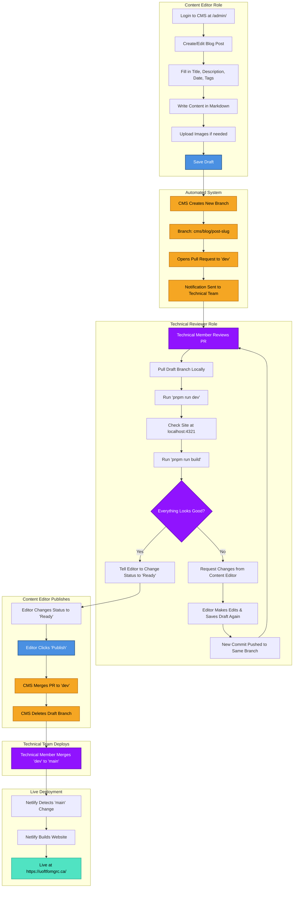
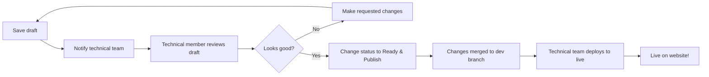

<p align="center">
  <a href="" rel="noopener">
 </a>
</p>

<h3 align="center"></h3>

<div align="center">

[]()
[](https://github.com/UofT-FoM-GRC/Website/issues)
[](https://github.com/UofT-FoM-GRC/Website/pulls)
[](LICENSE)
[](https://app.netlify.com/sites/uoft-fom-grc/deploys)

</div>

---

<p align="center"> Website for the University of Toronto Faculty of Management Graduate Representation Committee.
    <br> 
    <strong style="font-size: 1.5em;"><a href="https://uoft-fom-grc.netlify.app/" target="_blank">View Live Site</a></strong>
</p>

## 📝 Table of Contents

- [About](#🧐-about)
- [How It All Works](#🔄-how-it-all-works)
- [For Content Editors (Non-Technical)](#✍️-for-content-editors-non-technical)
  - [Getting Access](#getting-access)
  - [Creating & Editing Blog Posts](#creating--editing-blog-posts)
  - [Complete Workflow](#complete-workflow)
- [For Technical Team Members](#👨‍💻-for-technical-team-members)
  - [First-Time Setup](#first-time-setup)
  - [Understanding the Repository](#understanding-the-repository)
  - [Development Workflow](#development-workflow)
  - [Reviewing & Deploying Changes](#reviewing--deploying-changes)
- [Understanding the System](#🔧-understanding-the-system)
- [Troubleshooting](#🆘-troubleshooting)
- [Built Using](#⛏️-built_using)
- [Authors](#✍️-authors)

## 🧐 About

The Graduate Representation Committee (GRC) is a group of graduate students who represent the interests of all graduate students in the University of Toronto Faculty of Medicine. We support and advocate for graduate students, keep them informed about important policies, and actively seek their feedback to ensure our advocacy aligns with their needs.

This website is maintained by GRC members and uses modern web technologies to provide an easy-to-manage platform for sharing information with the graduate student body.

---

## 🔄 How It All Works

**Overview of the Complete Publishing Process**

This diagram shows the entire journey from creating content to it appearing live on the website:



**Key Points:**
- **Content Editors** (blue boxes) only need to use the CMS - no coding required
- **Automated System** (orange boxes) handles Git operations behind the scenes
- **Technical Reviewers** (purple boxes) test changes during draft phase before final publish
- **Live Deployment** (teal box) happens automatically when merged to main

**Timeline:**
- Content creation & save draft: 15-60 minutes (depending on post complexity)
- Technical review of draft: Usually 1-2 days
- Content editor publishes (merges to dev): ~1 minute after approval
- Technical team deploys (merges dev to main): When batching multiple posts or urgent
- Netlify build & deploy: 2-5 minutes after merge to main

---

## ✍️ For Content Editors (Non-Technical)

**If you just want to write and publish blog posts, this section is for you!**

### Getting Access

To manage blog content, you need either one of two things:

1. **Netlify Identity Account**
   - Contact the website administrator
   - They will send you an invitation email from Netlify
   - Click the link in the email
   - Set your password
   - You're ready to create content!

2. **GitHub Account**
   - If you don't have one, create a free account at [github.com](https://github.com)
   - Send your GitHub username to the administrator
   - They'll add you as a collaborator

### Creating & Editing Blog Posts

**Step 1: Access the CMS**

1. Go to: **https://uoft-fom-grc.netlify.app/admin/**
2. Log in with your Netlify Identity email/password or GitHub account
3. You'll see the content dashboard

**Step 2: Create a New Blog Post**

1. Click **"Blog Posts"** in the left sidebar
2. Click **"New Blog Post"** button (top right)
3. Fill in the form:
   - **Title**: Your blog post title (e.g., "Career Fair 2025")
   - **Description**: 1-2 sentence summary (shows on blog cards)
   - **Publish Date**: Click calendar icon and select date
   - **Hero Image** (optional): Click "Choose an image" → Upload or select existing
   - **Tags**: Select 1-3 tags that match your content (required)
   - **Body**: Write your content using Markdown (see quick reference below)

4. Click **"Save"** (top left)

**Step 3: Preview Your Post**

- While editing, you can see a live preview on the right side
- Make sure images display correctly
- Check formatting looks good

**Step 4: Submit for Review**

1. After saving your draft, notify the technical team (Slack/Discord/email)
2. Wait for technical reviewer to test your draft
3. If they request changes, edit the post and save again
4. Once approved by technical reviewer:
   - Click the status dropdown (shows "Draft")
   - Change to **"Ready"**
   - Click **"Publish"** → **"Publish now"**

✅ **Done!** Your changes are merged to the staging branch and ready for deployment.

### Complete Workflow

Here's how your changes get from the CMS to the live website:



**Timeline:**
- **Save draft**: Your changes create a draft branch immediately
- **Technical review**: Usually 1-2 days to review your draft
- **You publish**: After approval, change status to "Ready" and publish (merges to dev)
- **Deployment**: Technical team merges dev to main when batching posts or if urgent
- **Live**: 2-5 minutes after deployment

**You don't need to know Git or coding!** The CMS handles everything for you.

### Working with Images

**Best Practices:**
- Use `.webp` or `.jpg` format
- Recommended size: 1200x630px for hero images
- Keep file sizes under 500KB
- Use descriptive names: `career-fair-2025.webp` not `img123.webp`

**To add images:**

In the Hero Image field:
1. Click "Choose an image"
2. Click "Upload" or select from existing images
3. Select your file

In the blog body:
```markdown

```

### Available Tags

Select 1-3 tags that best describe your content:

| Tag | Use For |
|-----|---------|
| **employment** | Job postings, TA hiring, work opportunities |
| **career-planning-exploration** | Resume tips, career advice, mentorship |
| **continuing-education** | Courses, workshops, certifications |
| **health-wellness** | Mental health, fitness, wellness resources |
| **housing** | Housing listings, tips, rental information |
| **scholarships-bursaries-awards** | Funding opportunities, awards |
| **scholarship-award-grant-application-support** | Application help, workshops |
| **other** | Everything else |

### Markdown Quick Reference

```markdown
# Large Heading
## Medium Heading
### Small Heading

**Bold text**
*Italic text*

- Bullet point
- Another point

1. Numbered item
2. Second item

[Link text](https://example.com)

```

**Full guide:** [Markdown Cheatsheet](https://www.markdownguide.org/cheat-sheet/)

### Common Questions

**Q: How do I edit an existing post?**
A: Click "Blog Posts" → Click the post → Make changes → Save → Publish

**Q: Can I save a draft and come back later?**
A: Yes! Click "Save" anytime. It stays in "Draft" until you change the status.

**Q: I made a mistake after publishing. What do I do?**
A: Just edit the post again and republish. Contact the technical team if urgent.

**Q: My images aren't showing up**
A: Make sure the image path starts with `/assets/`

**Q: Who do I contact for help?**
A: Reach out to the GRC technical lead or post in the team Slack

---

## 👨‍💻 For Technical Team Members

**If you're maintaining the website or reviewing blog post changes, this section is for you.**

### First-Time Setup

Even if you have limited coding experience, you can maintain this website by following these steps.

#### Step 1: Install Required Software

**1.1 Install Node.js**

Node.js is the JavaScript runtime that powers the website.

- Go to: https://nodejs.org/
- Download the **LTS** (Long Term Support) version
- Run the installer
- Accept default settings
- Verify installation:
  ```bash
  node --version
  # Should show: v22.x.x or similar
  ```

**1.2 Install pnpm**

pnpm is a fast package manager (better than npm).

```bash
npm install -g pnpm
```

Verify:
```bash
pnpm --version
# Should show: 9.x.x or similar
```

**1.3 Install Git**

Git manages version control for the website.

- **Windows**: Download from https://git-scm.com/
- **Mac**: Install Xcode Command Line Tools:
  ```bash
  xcode-select --install
  ```
- **Linux**: 
  ```bash
  sudo apt-get install git  # Ubuntu/Debian
  sudo dnf install git      # Fedora
  ```

Verify:
```bash
git --version
# Should show: git version 2.x.x
```

**1.4 Get GitHub Access**

1. Create account at https://github.com (if you don't have one)
2. Contact the website administrator
3. They'll add you as a collaborator to the repository
4. Accept the invitation email

#### Step 2: Clone the Repository

"Cloning" means downloading the website code to your computer.

```bash
# Navigate to where you want to store the project
cd ~/Documents/GRC  # or wherever you prefer

# Clone the repository
git clone https://github.com/UofT-FoM-GRC/Website.git

# Enter the project folder
cd Website
```

#### Step 3: Install Dependencies

"Dependencies" are all the code libraries the website needs to run.

```bash
pnpm install
```

This will take 2-5 minutes. You'll see a lot of text scroll by - that's normal!

#### Step 4: Run the Development Server

```bash
pnpm run dev
```

You should see:
```
🚀 astro  v5.x.x started in XXXms

  ┃ Local    http://localhost:4321/
  ┃ Network  use --host to expose
```

Open your browser and go to: **http://localhost:4321/**

You should see the GRC website running locally! 🎉

**To stop the server:** Press `Ctrl+C` in the terminal

### Understanding the Repository

Here's what each folder/file does:

```
Website/
├── public/                  # Static files (images, fonts, etc.)
│   ├── assets/             # Blog images, backgrounds
│   ├── admin/              # CMS admin panel files
│   └── fonts/              # Website fonts
│
├── src/                    # Source code (the actual website)
│   ├── blog/              # Blog post markdown files ⭐
│   ├── components/        # Reusable UI pieces (header, footer, etc.)
│   ├── layouts/           # Page templates
│   ├── pages/             # Actual website pages
│   │   ├── index.astro   # Homepage
│   │   ├── blog/         # Blog listing page
│   │   ├── about/        # About page
│   │   └── resources/    # Resource pages
│   ├── styles/            # CSS styling
│   └── consts.ts          # Website-wide constants
│
├── notes/                  # Misc notes and documentation
├── .github/                # GitHub configuration
├── package.json            # Project dependencies list
├── pnpm-lock.yaml         # Locked dependency versions
├── astro.config.mjs       # Astro framework configuration
├── tsconfig.json          # TypeScript configuration
└── README.md              # This file!
```

**Key Files You'll Work With for Blogs:**
- `src/blog/*.md` - Blog post files (created via CMS or manually)
- `public/assets/` - Images for blog posts

**Files You Can Ignore:**
- `.astro/` - Auto-generated cache
- `node_modules/` - Installed dependencies
- `dist/` - Built website files

### Development Workflow

This is how you review and publish changes made through the CMS.

#### Scenario: A content editor saved a draft

**Step 1: Check for New Draft**

When a content editor saves a draft, the CMS creates a new branch and pull request.

1. Go to: https://github.com/UofT-FoM-GRC/Website/pulls
2. Look for PRs with label: `decap-cms/pending_publish`
3. Branch name will be: `cms/blog/post-slug-name`
4. Click on the PR to review

**Step 2: Pull Draft Branch to Your Computer**

```bash
# Make sure you're in the Website folder
cd ~/Documents/Website  # or wherever you cloned it

# Fetch all branches from GitHub
git fetch origin

# Switch to the draft branch (replace with actual branch name from PR)
git checkout cms/blog/post-slug-name
```

**Step 3: Review Changes Locally**

```bash
# Start the development server
pnpm run dev
```

Open http://localhost:4321/ in your browser.

**What to check:**
- ✅ New blog post appears on the blog page
- ✅ Images display correctly
- ✅ No broken links
- ✅ Formatting looks good
- ✅ Tags are correct
- ✅ No typos in title/description

**Step 4: Test the Build**

The development server is different from the live site. Make sure it actually builds:

```bash
# Stop the dev server (Ctrl+C)
# Run the build command
pnpm run build
```

If you see errors, something is wrong! Common issues:
- Missing required fields in blog post
- Broken image links
- Invalid frontmatter YAML syntax

If successful, you'll see:
```
✓ Completed in XXXms.
```

#### Scenario: Changes look good, let editor publish

**Step 1: Approve the Draft**

1. Leave a comment on the PR: "Looks good! Ready to publish ✅"
2. Notify the content editor (Slack/Discord/email)
3. Editor will change status to "Ready" and click "Publish" in CMS
4. The CMS will automatically merge the PR to `dev` and delete the draft branch

**Step 2: Deploy to Live Site (When Ready)**

After one or more posts are published to `dev`, merge dev → main:

The `main` branch is what's live on the website. Let's push the changes there.

**Option A: Via GitHub (Easier)**

1. Go to: https://github.com/UofT-FoM-GRC/Website
2. Click **"Pull requests"** → **"New pull request"**
3. Set: `base: main` ← `compare: dev`
4. Click **"Create pull request"**
5. Review one more time
6. Click **"Merge pull request"**
7. Click **"Confirm merge"**

**Option B: Via Command Line**

```bash
# Pull latest dev changes first in case someone else updated it in the meantime and fix any conflicts if needed
git checkout dev
git pull origin dev

# Switch to main branch
git checkout main

# Pull latest main in case anyone else updated it
git pull origin main

# Merge dev into main
git merge dev

# Push to GitHub
git push origin main
```

**Step 3: Watch Netlify Deploy**

1. Go to: https://app.netlify.com/sites/uoft-fom-grc/deploys
2. You'll see a new deploy starting
3. Wait 2-5 minutes for it to complete
4. Check the live site: https://uoft-fom-grc.netlify.app/ or https://uoftfomgrc.ca/

🎉 **Changes are now live!**

#### Scenario: Draft needs fixing

If you find issues during review:

1. **Don't approve the draft yet**
2. Leave a comment on the PR with specific issues to fix
3. Contact the content editor (Slack/Discord/email)
4. Editor makes changes in CMS and saves draft again
5. New commit is pushed to the same draft branch
6. Pull the updated branch and review again:
   ```bash
   git checkout cms/blog/post-slug-name
   git pull origin cms/blog/post-slug-name
   pnpm run dev
   ```

### Reviewing & Deploying Changes

**Quick Reference Workflow:**

```bash
# 1. Review draft - Fetch and checkout draft branch
git fetch origin
git checkout cms/blog/post-slug-name

# 2. Test locally
pnpm run dev
# → Check http://localhost:4321/

# 3. Build test
pnpm run build

# 4. If issues, tell editor to fix and wait for update
# If good, approve on GitHub and tell editor to publish

# 5. After editor publishes (merges to dev), deploy when ready
git checkout dev
git pull origin dev
git checkout main
git pull origin main
git merge dev
git push origin main

# 6. Monitor deploy
# → https://app.netlify.com/sites/uoft-fom-grc/deploys
```

**When to deploy:**
- ✅ After reviewing 1-3 blog posts and/or weekly updates
- ✅ Urgently (for time-sensitive posts)
- ❌ Not after every single post (wastes build minutes on Netlify; we're on a free plan)

### Advanced: Testing CMS Locally

If you want to test the CMS interface on your local machine:

```bash
# Terminal 1: Run CMS proxy
npx decap-server

# Terminal 2: Run dev server
pnpm run dev
```

Access CMS at: http://localhost:4321/admin/

**Note:** Local CMS bypasses authentication and workflow. Changes save directly to files.

---

## 🔧 Understanding the System

### The Three Branches

**`main` branch** = Live website
- What users see at uoft-fom-grc.netlify.app
- Protected - only technical team can update
- Triggers automatic deployment on changes

**`dev` branch** = Development/staging area
- Where CMS changes go first
- Test changes here before going live
- Doesn't trigger deployments (saves build minutes)

**`feat-*` branches** = Custom website changes & features
- For major changes or new features indepdendent of CMS
- Created from `dev` branch
- Use `git rebase dev` to keep up to date
- Merge into `dev` when ready
- Delete after merging

### The Tech Stack

| Component | Purpose | Learn More |
|-----------|---------|------------|
| **Astro** | Web framework - builds the site | [astro.build](https://astro.build/) |
| **Decap CMS** | Content management system | [decapcms.org](https://decapcms.org/) |
| **Netlify** | Hosting & deployment | [netlify.com](https://www.netlify.com/) |
| **GitHub** | Code storage & version control | [github.com](https://github.com/) |
| **pnpm** | Package manager | [pnpm.io](https://pnpm.io/) |
| **Markdown** | Content formatting | [markdownguide.org](https://www.markdownguide.org/) |

### Build Minutes Optimization

Netlify's free tier gives us limited build minutes per month. To conserve them:

- ✅ CMS changes go to `dev` (no build)
- ✅ Batch multiple posts before deploying
- ✅ Only `main` branch triggers builds
- ❌ Don't merge to `main` after every single change

---

## 🆘 Troubleshooting

### For Content Editors

**Problem: Can't log in to CMS**
- ✅ Check: Did you accept the Netlify invitation email?
- ✅ Check: Did you set a password?
- ✅ Try: Clear browser cache and try again
- ✅ Contact: Website administrator to resend invitation

**Problem: Images not showing in preview**
- ✅ Check: Path starts with `/assets/`
- ✅ Check: Image was uploaded successfully
- ✅ Try: Use existing image from media library first

**Problem: Can't publish (button grayed out)**
- ✅ Check: All required fields filled? (Title, Description, Date, Tags)
- ✅ Check: Status set to "Ready"?
- ✅ Try: Save draft first, then change status

**Problem: Published but don't see changes on website**
- ✅ Understand: Changes go to `dev` branch first
- ✅ Wait: Technical reviewer needs to deploy to live site
- ✅ Timeline: Usually 1-3 days depending on urgency

### For Technical Members

**Problem: `pnpm install` fails**
- ✅ Check: Node.js version (need v18+)
  ```bash
  node --version
  ```
- ✅ Try: Delete `node_modules` and `pnpm-lock.yaml`, reinstall
  ```bash
  rm -rf node_modules pnpm-lock.yaml
  pnpm install
  ```

**Problem: `pnpm run dev` fails**
- ✅ Check: Did you run `pnpm install`?
- ✅ Check: Port 4321 not already in use?
- ✅ Try: Different port
  ```bash
  pnpm run dev -- --port 3000
  ```

**Problem: Build fails with frontmatter error**
- ✅ Check: Blog post YAML syntax is valid
- ✅ Check: Required fields present (title, description, pubDate, tags)
- ✅ Check: Tags are from the allowed list
- ✅ Fix: Edit the markdown file directly in `src/blog/`

**Problem: Merge conflicts**
- ✅ Don't panic! This means two people edited the same file
- ✅ Option 1: Use GitHub's web interface to resolve
- ✅ Option 2: Resolve locally:
  ```bash
  git status  # See which files conflict
  # Edit files, remove conflict markers
  git add .
  git commit -m "resolve merge conflict"
  git push
  ```

**Problem: Netlify build fails**
- ✅ Check: Build logs at https://app.netlify.com/sites/uoft-fom-grc/deploys
- ✅ Look for: Error messages (usually at the end)
- ✅ Common causes:
  - Invalid frontmatter in blog post
  - Missing image file
  - TypeScript errors
- ✅ Fix locally, test build, then deploy again

**Problem: Changes deployed but not visible**
- ✅ Try: Hard refresh browser (`Ctrl+Shift+R` or `Cmd+Shift+R`)
- ✅ Try: Clear browser cache
- ✅ Check: Was the Netlify deploy successful?
- ✅ Wait: CDN cache may take 1-5 minutes to update

### Getting Help

**For urgent issues:**
1. Check this README first
2. Check existing [GitHub Issues](https://github.com/UofT-FoM-GRC/Website/issues)
3. Contact the technical lead
4. Create new GitHub issue if it's a bug

**For questions:**
- Team Slack/Discord
- GRC meetings
- Email the technical lead

**For bugs or feature requests:**
- Create GitHub issue: https://github.com/UofT-FoM-GRC/Website/issues/new
- Include:
  - What you were trying to do
  - What happened instead
  - Steps to reproduce
  - Screenshots if relevant

---

## ⛏️ Built Using

- [Astro](https://astro.build/) - Modern web framework
- [TailwindCSS](https://tailwindcss.com/) - CSS styling
- [Decap CMS](https://decapcms.org/) - Content management
- [Netlify](https://www.netlify.com/) - Hosting & deployment
- [TypeScript](https://www.typescriptlang.org/) - Type safety

## ✍️ Authors

- [@MauricePasternak](https://github.com/MauricePasternak) - Creator, author of this guide, and original maintainer

See [contributors](https://github.com/UofT-FoM-GRC/Website/contributors) for full list of people who have worked on this project.

## 🎉 Acknowledgements

- All members of the GRC, past and present, for their dedication to the graduate student body
- The open-source community for the amazing tools that power this website